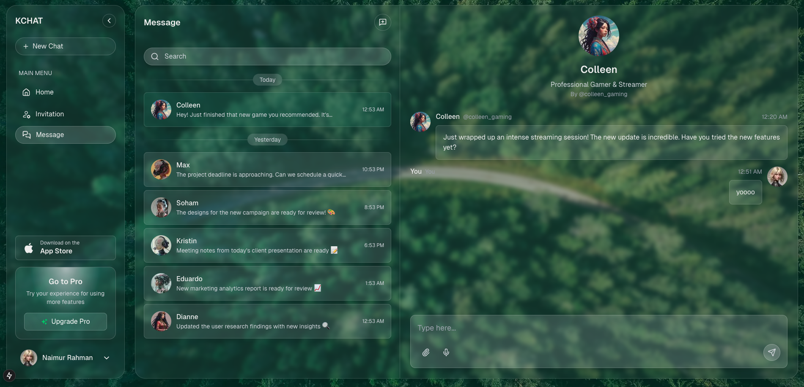

# GenChat - A Chat Application

This is a chat application UI clone built with Next.js, Tailwind CSS . It allows users to chat with each other in real-time.

## Getting Started

First, run the development server:

```bash
npm run dev
# or
yarn dev
# or
pnpm dev
```

Open [http://localhost:3000](http://localhost:3000) with your browser to see the application.

## Features

## Message Storage & Sorting

- Persistent message history using browser's local storage
- Messages are stored per user conversation
- Maintains complete chat history across browser sessions
- Automatic message backup and recovery
- Messages grouped by timeframes (Today/Yesterday)
- Full-text search across all conversations
- Search through message content and user names

## Tech Stack

- [Next.js](https://nextjs.org) - React framework
- [Tailwind CSS](https://tailwindcss.com) - Styling

## This is how the app looks like

This is a glassmorphism UI type of app featuring:

- Frosted glass effect with subtle transparency
- Soft, blurred backgrounds
- Light border highlights
- Modern, clean aesthetic
- Smooth shadows and depth effects
- Seamless backdrop-filter effects
- Responsive design that maintains the glass effect across screen sizes

The UI design focuses on creating a modern, ethereal experience while maintaining excellent readability and usability.



## Development

You can start editing the application by modifying files in the `app` directory. The application auto-updates as you edit files.

## Learn More

To learn more about the technologies used in this project:

- [Next.js Documentation](https://nextjs.org/docs)
- [Tailwind CSS Documentation](https://tailwindcss.com/docs)

## Deployment

This application is deployed on [Vercel](https://vercel.com). You can view the live version at [https://gen-chat-ui-nbuk.vercel.app/].
